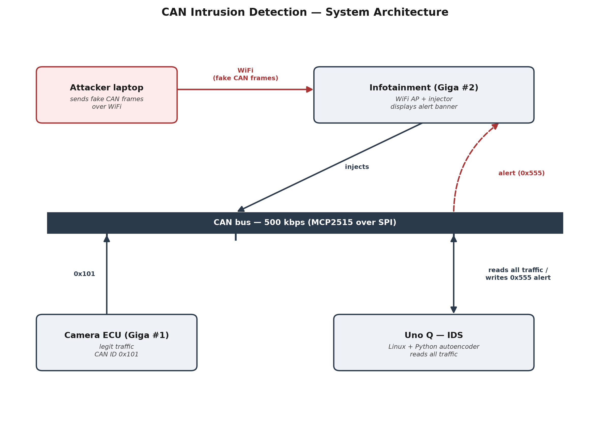

# CAN Intrusion Detection (WiFi infotainment attack surface + autoencoder IDS)

Adds an AI-based intrusion-detection layer and a realistic attack surface. The infotainment head unit
hosts a WiFi access point; an attacker who reaches it injects spoofed CAN frames,
and a separate gateway ECU running an **autoencoder** detects the anomaly and warns
the driver. This mirrors the 2015 Jeep Cherokee attack path (infotainment → CAN).



> Export the architecture diagram to `docs/architecture-can-intrusion-detection.png`.

## Nodes

| Node | Firmware / code | Role |
|------|-----------------|------|
| Camera ECU (Giga #1) | `firmware/giga1_camera_ecu/` | Unchanged from the Sensor Fusion Baseline feature — legit `0x101` baseline traffic |
| Infotainment (Giga #2) | `firmware/giga2_infotainment/` | WiFi AP + web dashboard; injects `spoof/flood/replay/fuzz`; shows the alert |
| WiFi AP checkpoint | `firmware/phase1_wifi_ap_test/` | Standalone test to prove the AP before integration |
| IDS gateway (Uno Q) | `firmware/unoq_can_forwarder/` + `ids/` | MCU streams frames to Linux; Python autoencoder scores them and broadcasts `0x555` |

## Why an autoencoder

Real attacks are open-ended and unlabeled. The autoencoder trains only on *normal*
traffic and flags anything that reconstructs poorly — so it generalises to attacks
it never saw. Detection leans on timing/frequency features (a spoofed `0x101`
doubles its rate and breaks its regular period).

## Host-side pipeline (`ids/`)

| Script | Purpose |
|--------|---------|
| `features.py` | Shared window feature extraction (identical in train + detect) |
| `capture.py` | Log CAN frames to labeled CSV |
| `train.py` | Train the autoencoder on normal data, pick a threshold |
| `detect.py` | Live inference; sends `ALERT,type,score` to the MCU on anomaly |

## Run it

```bash
# 1) flash all four firmware sketches (start with phase1_wifi_ap_test on Giga #2)
# 2) capture data on the Uno Q Linux side
cd ids && pip install -r requirements.txt
python capture.py --port /dev/ttyACM0 --label normal --out ../data/normal.csv
python capture.py --port /dev/ttyACM0 --label spoof  --out ../data/attack_spoof.csv
# 3) train
python train.py --normal ../data/normal.csv --attacks ../data/attack_spoof.csv
# 4) detect live
python detect.py --port /dev/ttyACM0
```

Connect a laptop to the `CarInfotainment` AP, trigger an injection from the
dashboard, and watch the alert reach the head unit's OLED and web page.

## Results

_Fill in from `train.py` output._

| Attack | Detection rate | False-positive rate |
|--------|---------------|---------------------|
| Spoof  | – | – |
| Flood  | – | – |
| Replay | – | – |
| Fuzz   | – | – |
